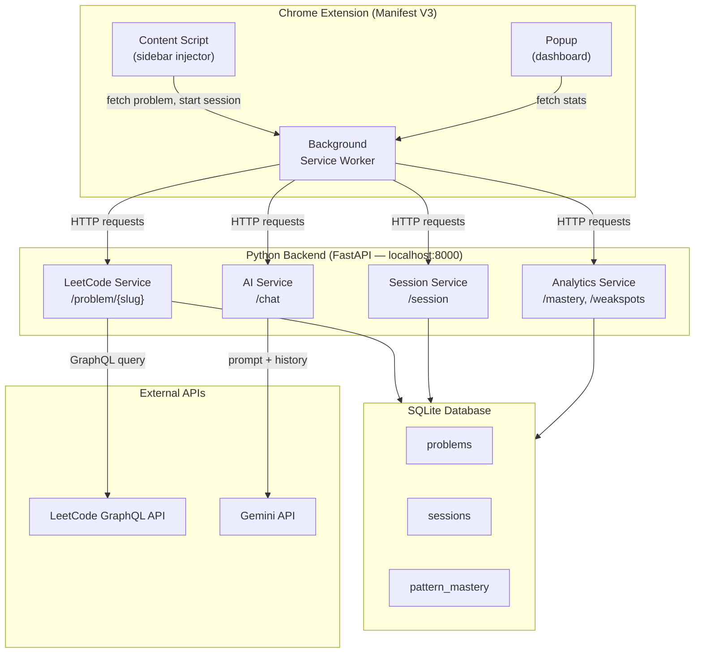
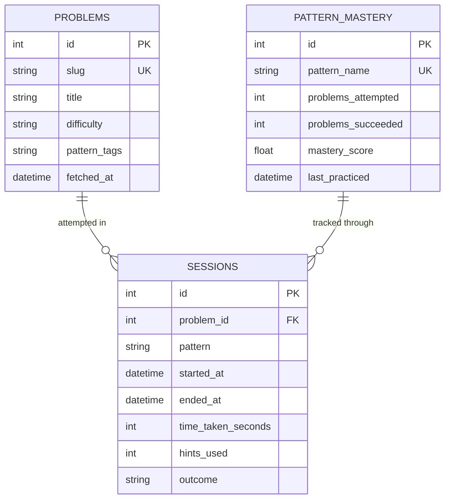
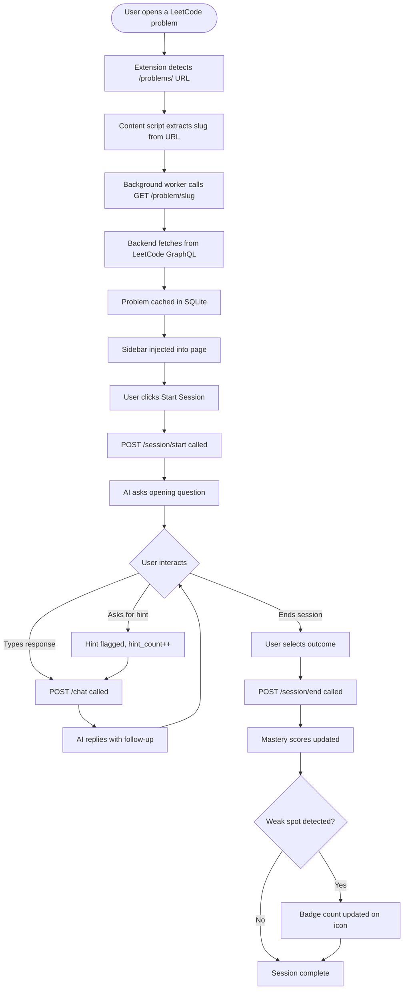
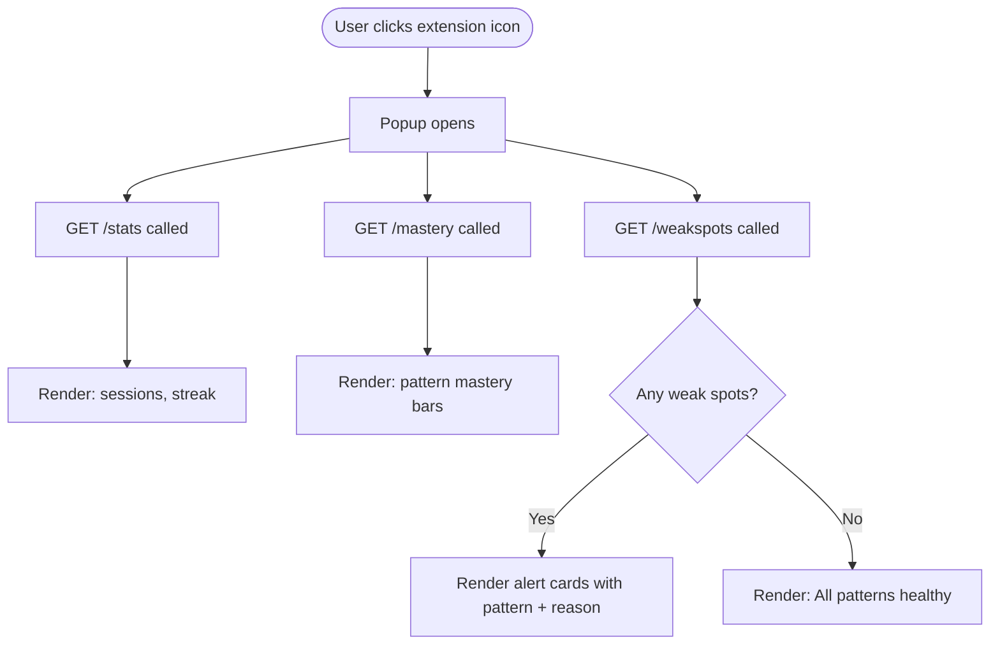

# Software Requirements Specification
## LeetCode AI Interview Coach — Chrome Extension

**Version:** 1.0  
**Author:** [Your Name]  
**Date:** July 2026  
**Status:** Draft

---

## Table of Contents

1. [Introduction](#1-introduction)
2. [Overall Description](#2-overall-description)
3. [Functional Requirements](#3-functional-requirements)
4. [Non-Functional Requirements](#4-non-functional-requirements)
5. [System Architecture](#5-system-architecture)
6. [Data Models](#6-data-models)
7. [API Specification](#7-api-specification)
8. [User Flows](#8-user-flows)
9. [Constraints and Assumptions](#9-constraints-and-assumptions)

---

## 1. Introduction

### 1.1 Purpose

This document specifies the requirements for **LeetCode AI Interview Coach**, a Chrome Extension that transforms passive LeetCode grinding into an active, structured interview simulation experience. It is intended to serve as a reference for design, implementation, and evaluation of the system.

### 1.2 Problem Statement

Developers preparing for technical interviews face three compounding problems:

| # | Problem | Root Cause |
|---|---------|------------|
| 1 | Knowledge decay — patterns solved once are forgotten | No structured revisiting |
| 2 | Blind self-assessment — no visibility into actual weak spots | No cross-session tracking |
| 3 | Poor interview readiness — solving alone ≠ solving under pressure | No simulation of real interview conditions |

Existing tools (ChatGPT on tab, NeetCode, etc.) solve none of these because they are **stateless** — they don't know the user across sessions.

### 1.3 Proposed Solution

A stateful Chrome Extension + Python backend that:
- Injects an AI mock interviewer sidebar directly into LeetCode problem pages
- Tracks every session, logging patterns, hints used, and outcomes
- Builds a per-user mastery profile across DSA patterns over time
- Surfaces weak spots proactively before they become interview liabilities

### 1.4 Scope

**In scope:**
- Chrome Extension (Manifest V3)
- FastAPI Python backend
- SQLite local database
- Gemini API integration for AI interviewer
- LeetCode GraphQL API integration for problem extraction
- Pattern mastery tracking
- Weak spot detection and alerts
- Session dashboard (popup)

**Out of scope (deferred):**
- Skill tree / pattern unlock progression
- Multi-user / cloud sync
- Mobile support
- Boss Battle mode
- Gamification beyond pattern mastery

### 1.5 Definitions and Acronyms

| Term | Definition |
|------|-----------|
| DSA | Data Structures and Algorithms |
| LLM | Large Language Model |
| Pattern | A recurring algorithmic approach (e.g., Sliding Window, DP, BFS) |
| Session | A single problem-solving attempt tracked by the extension |
| Mastery Score | A computed score (0–100) representing competence in a given pattern |
| Weak Spot | A pattern with low mastery score or long inactivity period |
| BYOK | Bring Your Own Key — users supply their own API key |

---

## 2. Overall Description

### 2.1 Product Perspective

The system has three layers that work together:

```
┌─────────────────────────────────────────────────────────┐
│                  Chrome Extension                        │
│   Content Script │ Sidebar UI │ Popup Dashboard          │
└─────────────────────────┬───────────────────────────────┘
                          │ HTTP (localhost)
┌─────────────────────────▼───────────────────────────────┐
│                  Python Backend (FastAPI)                 │
│  LeetCode Service │ AI Service │ Session Service          │
│  Analytics Service                                        │
└──────────┬───────────────────────────┬──────────────────┘
           │                           │
┌──────────▼──────┐         ┌──────────▼──────────────────┐
│  SQLite Database │         │  External APIs               │
│  (local)         │         │  LeetCode GraphQL            │
└──────────────────┘         │  Gemini API                  │
                             └─────────────────────────────┘
```

### 2.2 User Characteristics

**Primary User:** A software developer (intermediate level) actively preparing for technical interviews at tech companies. They are already familiar with LeetCode and use it daily. They do not need to be taught what DSA is — they need to be pushed to practice more effectively.

### 2.3 Operating Environment

- Chrome browser (v100+)
- Python 3.10+ running locally
- localhost:8000 backend (dev mode)
- Internet connection (for LeetCode GraphQL + Gemini API)

---

## 3. Functional Requirements

### 3.1 Problem Detection and Extraction

| ID | Requirement | Priority |
|----|-------------|----------|
| FR-01 | The extension SHALL detect when the user navigates to a LeetCode problem page | Must Have |
| FR-02 | The extension SHALL extract the problem slug from the URL | Must Have |
| FR-03 | The backend SHALL fetch problem metadata (title, difficulty, tags) from LeetCode GraphQL API | Must Have |
| FR-04 | The backend SHALL map LeetCode tags to internal DSA pattern categories | Must Have |
| FR-05 | Extracted problem data SHALL be cached in SQLite to avoid repeat API calls | Should Have |

### 3.2 AI Mock Interviewer (Sidebar)

| ID | Requirement | Priority |
|----|-------------|----------|
| FR-06 | The extension SHALL inject a collapsible sidebar UI on LeetCode problem pages | Must Have |
| FR-07 | The user SHALL be able to start an interview session from the sidebar | Must Have |
| FR-08 | The AI SHALL act as an interviewer, asking questions rather than giving answers | Must Have |
| FR-09 | The AI SHALL ask follow-up questions based on the user's responses | Must Have |
| FR-10 | The AI SHALL never provide code solutions directly | Must Have |
| FR-11 | The AI SHALL offer hints only when the user explicitly requests one | Must Have |
| FR-12 | The sidebar SHALL display the conversation history in a chat-like interface | Must Have |
| FR-13 | The user SHALL be able to end a session and submit a self-assessed outcome | Must Have |

### 3.3 Session Logging

| ID | Requirement | Priority |
|----|-------------|----------|
| FR-14 | Every session SHALL be logged with: problem ID, start time, end time, hints used, outcome | Must Have |
| FR-15 | Time elapsed during a session SHALL be tracked automatically | Must Have |
| FR-16 | The backend SHALL update pattern mastery scores after every session | Must Have |

### 3.4 Pattern Mastery

| ID | Requirement | Priority |
|----|-------------|----------|
| FR-17 | The system SHALL maintain a mastery score (0–100) per DSA pattern | Must Have |
| FR-18 | Mastery score SHALL increase on successful sessions and decrease on failed ones | Must Have |
| FR-19 | The dashboard popup SHALL display mastery scores per pattern as a visual bar | Must Have |
| FR-20 | Patterns SHALL be color-coded by mastery level (red / yellow / green) | Should Have |

### 3.5 Weak Spot Detection and Alerts

| ID | Requirement | Priority |
|----|-------------|----------|
| FR-21 | The system SHALL flag a pattern as a weak spot if mastery score < 40 | Must Have |
| FR-22 | The system SHALL flag a pattern as a weak spot if not practiced in > 7 days | Must Have |
| FR-23 | Weak spot alerts SHALL appear in the extension popup | Must Have |
| FR-24 | Alerts SHALL include: pattern name, last practiced date, current mastery score | Must Have |
| FR-25 | The extension icon badge SHALL update to show number of active weak spots | Should Have |

### 3.6 Dashboard Popup

| ID | Requirement | Priority |
|----|-------------|----------|
| FR-26 | The popup SHALL show total sessions completed | Must Have |
| FR-27 | The popup SHALL show pattern mastery grid | Must Have |
| FR-28 | The popup SHALL show active weak spot alerts | Must Have |
| FR-29 | The popup SHALL show a streak counter (days with at least one session) | Should Have |

---

## 4. Non-Functional Requirements

| ID | Category | Requirement |
|----|----------|-------------|
| NFR-01 | Performance | Sidebar SHALL inject within 500ms of page load |
| NFR-02 | Performance | AI response SHALL arrive within 5 seconds |
| NFR-03 | Reliability | Backend SHALL handle LeetCode API failures gracefully with error messages |
| NFR-04 | Security | Gemini API key SHALL be stored in backend `.env`, never exposed to the extension |
| NFR-05 | Usability | The sidebar SHALL be collapsible and not obstruct the problem description |
| NFR-06 | Usability | The extension SHALL work without requiring user login/account creation |
| NFR-07 | Maintainability | Backend routes SHALL be modular (one file per service) |
| NFR-08 | Portability | Backend SHALL run on Windows, Mac, and Linux without modification |

---

## 5. System Architecture

### 5.1 High-Level Architecture



### 5.2 Component Descriptions

| Component | Technology | Responsibility |
|-----------|-----------|----------------|
| Content Script | JavaScript (MV3) | Detects LeetCode problem page, injects sidebar HTML/CSS, captures problem slug |
| Popup | HTML + CSS + JS | Renders dashboard: mastery scores, weak spot alerts, streak |
| Background Worker | JavaScript (MV3) | Routes messages between content script/popup and backend API |
| LeetCode Service | FastAPI + httpx | Queries LeetCode GraphQL for problem data, caches in SQLite |
| AI Service | FastAPI + Google Generative AI SDK | Manages conversation history, sends prompts to Gemini, enforces interviewer persona |
| Session Service | FastAPI + SQLite | Logs session start/end, hints used, outcome |
| Analytics Service | FastAPI + SQLite | Computes mastery scores, detects weak spots |
| SQLite Database | SQLite3 | Persists all user data locally |

### 5.3 AI Interviewer Behavior

The AI is given a strict system prompt that enforces these rules:

```
You are a technical interviewer at a top tech company.
The candidate is attempting: {problem_title} (Difficulty: {difficulty}, Pattern: {pattern}).

Rules:
- NEVER give the solution or write code
- Ask clarifying questions about their approach
- Ask about time and space complexity
- Challenge their assumptions
- If they are stuck, ask guiding questions (don't reveal answers)
- Only provide a hint if the user explicitly says "give me a hint"
- Keep responses concise (2-3 sentences max per turn)
```

---

## 6. Data Models

### 6.1 Entity Relationship Diagram



### 6.2 Table Definitions

**problems**
| Column | Type | Description |
|--------|------|-------------|
| id | INTEGER PK | Auto-increment |
| slug | TEXT UNIQUE | LeetCode URL slug e.g. `two-sum` |
| title | TEXT | Display title |
| difficulty | TEXT | Easy / Medium / Hard |
| pattern_tags | TEXT | JSON array of tags e.g. `["Array","Hash Table"]` |
| fetched_at | DATETIME | When data was cached |

**sessions**
| Column | Type | Description |
|--------|------|-------------|
| id | INTEGER PK | Auto-increment |
| problem_id | INTEGER FK | References problems.id |
| pattern | TEXT | Primary pattern for this session |
| started_at | DATETIME | Session start timestamp |
| ended_at | DATETIME | Session end timestamp |
| time_taken_seconds | INTEGER | Duration |
| hints_used | INTEGER | Number of times user asked for hint |
| outcome | TEXT | `success` / `partial` / `failed` |

**pattern_mastery**
| Column | Type | Description |
|--------|------|-------------|
| id | INTEGER PK | Auto-increment |
| pattern_name | TEXT UNIQUE | e.g. `Sliding Window` |
| problems_attempted | INTEGER | Total attempts |
| problems_succeeded | INTEGER | Successful outcomes |
| mastery_score | REAL | Computed 0–100 |
| last_practiced | DATETIME | Most recent session timestamp |

### 6.3 Mastery Score Formula

```
mastery_score = (problems_succeeded / problems_attempted) × 100
             × recency_weight

where recency_weight:
  - days_since < 3  → 1.0
  - days_since 3–7  → 0.85
  - days_since 7–14 → 0.65
  - days_since > 14 → 0.4
```

---

## 7. API Specification

Base URL: `http://localhost:8000`

### 7.1 Endpoints

| Method | Endpoint | Description | Request Body | Response |
|--------|----------|-------------|--------------|----------|
| GET | `/problem/{slug}` | Fetch + cache problem data | — | `{id, title, difficulty, pattern_tags}` |
| POST | `/chat` | Send a message to AI interviewer | `{message, history, problem_context}` | `{reply}` |
| POST | `/session/start` | Begin a new session | `{problem_id, pattern}` | `{session_id, started_at}` |
| POST | `/session/end` | End a session | `{session_id, hints_used, outcome}` | `{success}` |
| GET | `/mastery` | Get all pattern mastery scores | — | `[{pattern, score, last_practiced}]` |
| GET | `/weakspots` | Get current weak spot alerts | — | `[{pattern, score, days_since, reason}]` |
| GET | `/stats` | Get summary stats for popup | — | `{total_sessions, streak, weakspot_count}` |

### 7.2 Example Payloads

**POST /chat — Request**
```json
{
  "message": "I think I can use a hashmap here",
  "history": [
    {"role": "assistant", "content": "Walk me through your initial approach."},
    {"role": "user", "content": "I think I can use a hashmap here"}
  ],
  "problem_context": {
    "title": "Two Sum",
    "difficulty": "Easy",
    "pattern": "Hash Table"
  }
}
```

**POST /chat — Response**
```json
{
  "reply": "Good instinct. What exactly would you store as the key and value in that hashmap, and why?"
}
```

**GET /weakspots — Response**
```json
[
  {
    "pattern": "Dynamic Programming",
    "mastery_score": 32.0,
    "days_since": 9,
    "reason": "Low mastery score (32) + not practiced in 9 days"
  },
  {
    "pattern": "Binary Search",
    "mastery_score": 61.0,
    "days_since": 15,
    "reason": "Not practiced in 15 days"
  }
]
```

---

## 8. User Flows

### 8.1 Primary Flow — Solving a Problem



### 8.2 Dashboard Flow



---

## 9. Constraints and Assumptions

| # | Constraint / Assumption |
|---|------------------------|
| 1 | Backend runs locally on the user's machine — no cloud deployment |
| 2 | LeetCode GraphQL API is unofficial and may change without notice |
| 3 | Gemini API free tier rate limits may throttle heavy usage |
| 4 | SQLite data is local only — no sync across devices |
| 5 | User must manually start the Python backend before using the extension |
| 6 | Extension operates only on `leetcode.com/problems/*` pages |
| 7 | Outcome (success/partial/fail) is self-assessed by the user at session end |
| 8 | A single primary pattern per problem is derived from the first LeetCode tag |

---

*End of SRS Document*
